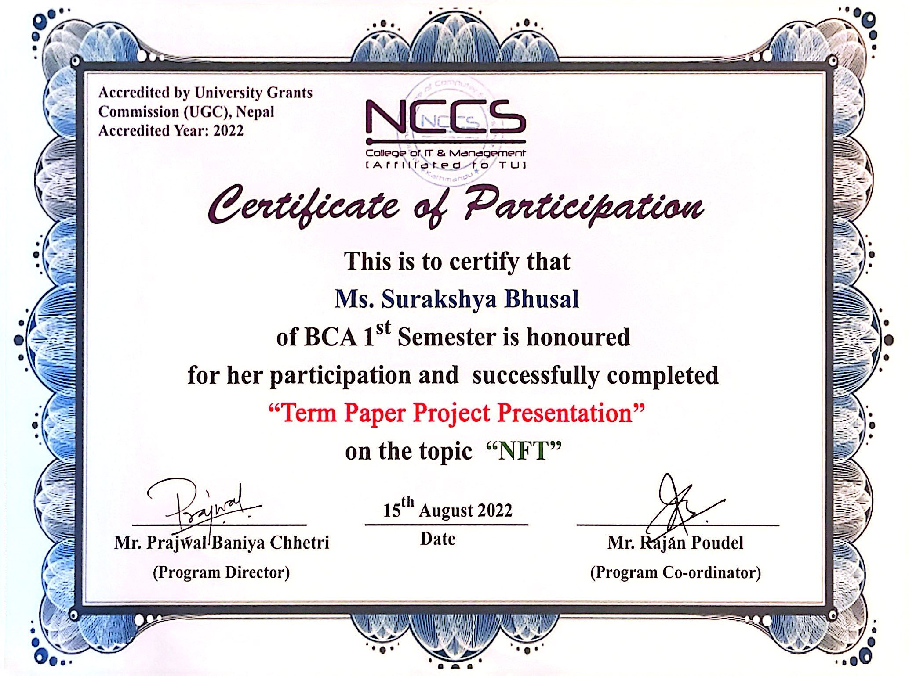
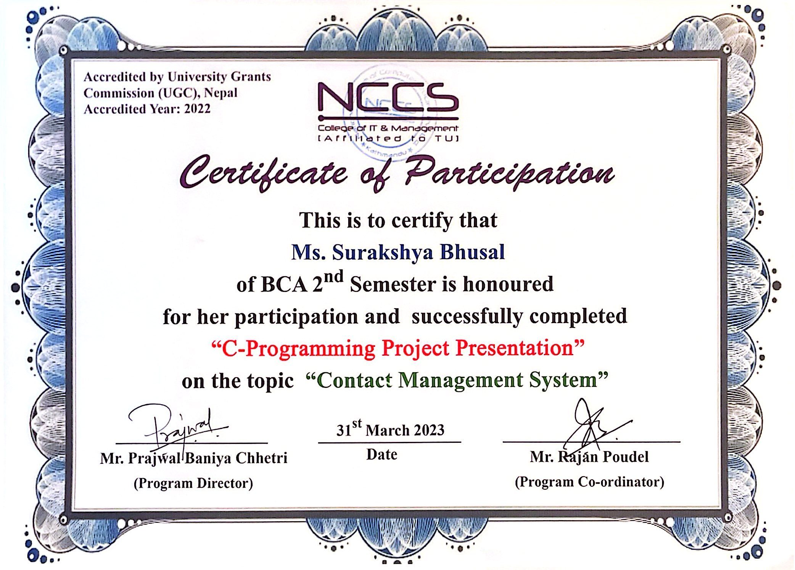
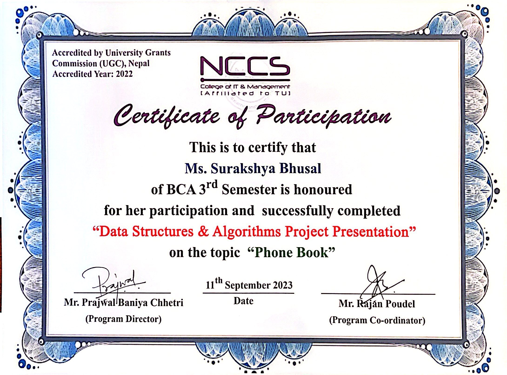
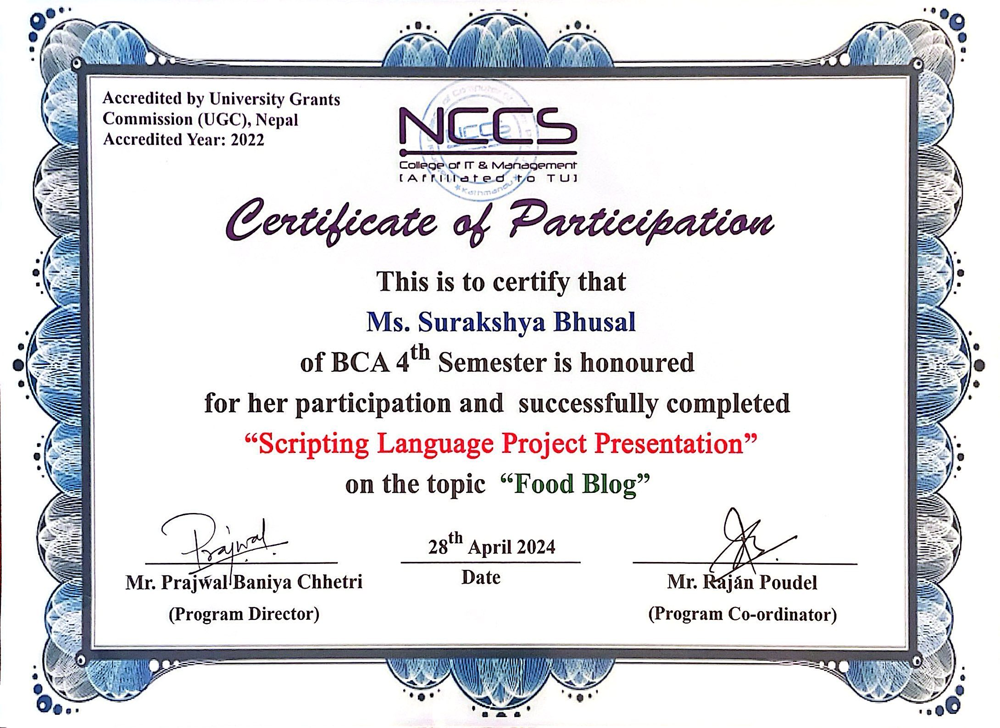
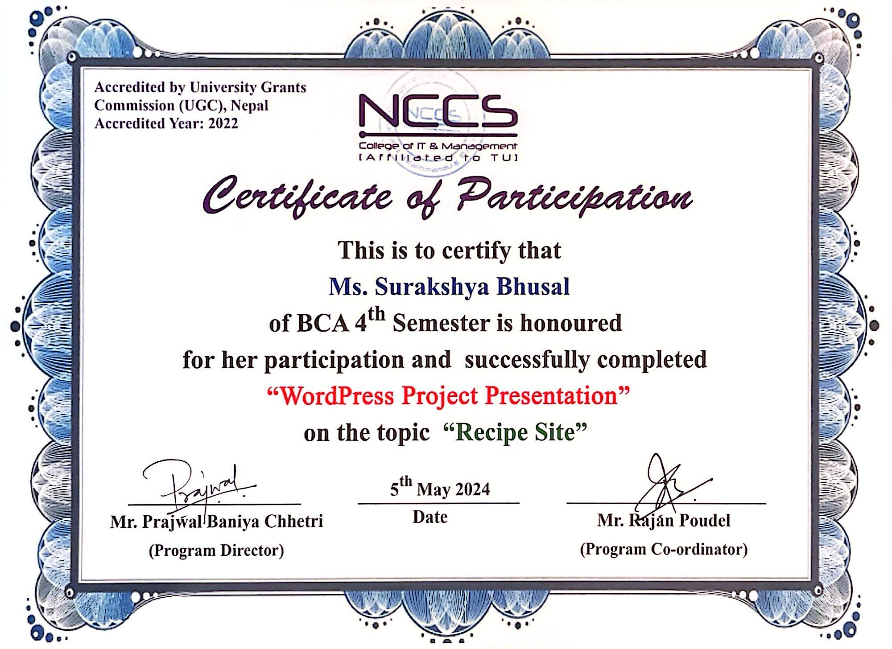
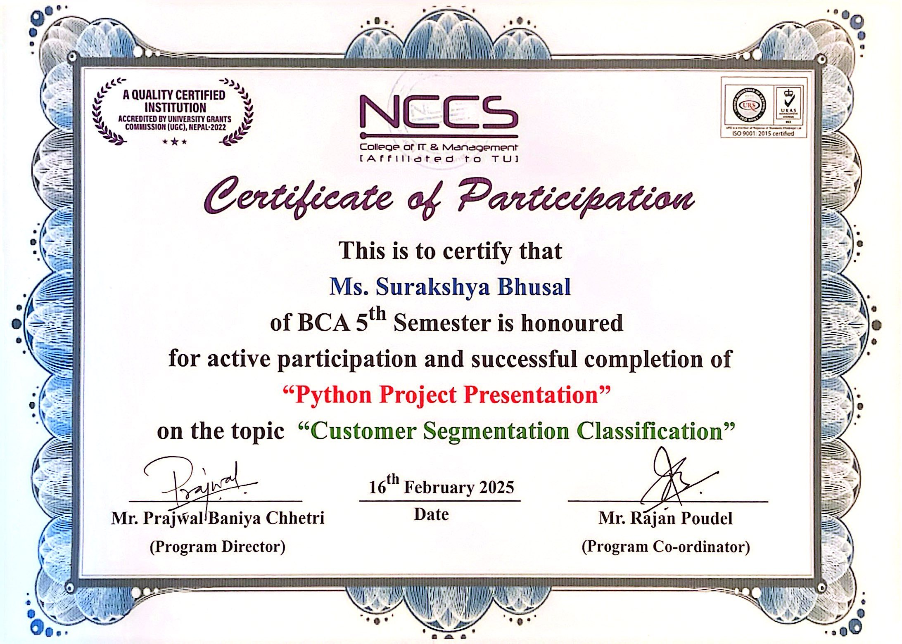
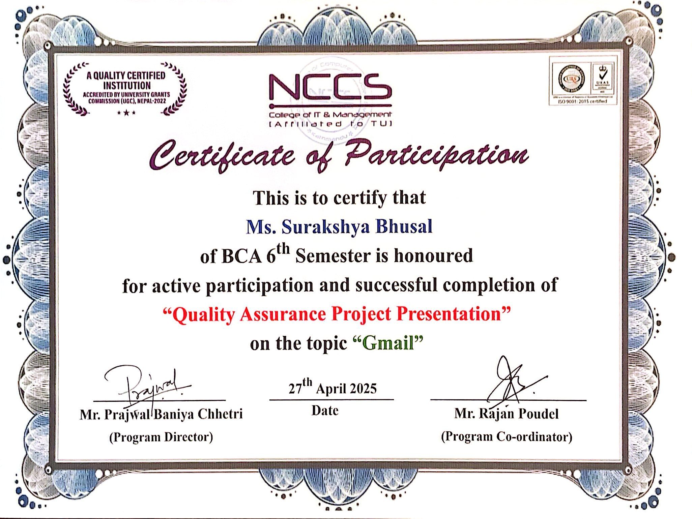

# 🎓 Certificates — Surakshya Bhusal

Certificates of participation earned during my **Bachelor of Computer Applications (BCA)** at
**NCCS College of IT & Management** (affiliated to Tribhuvan University, Nepal), one for each semester's project presentation.

📄 **[Download all certificates (PDF)](./Surakshya-Bhusal-Certificates.pdf)**

## Summary

| # | Project Presentation | Project Topic | Semester | Date |
|---|----------------------|---------------|----------|------|
| 1 | Term Paper | NFT | BCA 1st | 15 Aug 2022 |
| 2 | C Programming | Contact Management System | BCA 2nd | 31 Mar 2023 |
| 3 | Data Structures & Algorithms | Phone Book | BCA 3rd | 11 Sep 2023 |
| 4 | Scripting Language | Food Blog | BCA 4th | 28 Apr 2024 |
| 5 | WordPress | Recipe Site | BCA 4th | 5 May 2024 |
| 6 | Python | Customer Segmentation Classification | BCA 5th | 16 Feb 2025 |
| 7 | Quality Assurance | Gmail | BCA 6th | 27 Apr 2025 |

**Skills covered:** C · Data Structures & Algorithms · Scripting / Web Development · WordPress · Python (Machine Learning) · Software Quality Assurance & Testing

---

## Certificates

### 1. Term Paper Project Presentation: *NFT*
BCA 1st Semester · 15 August 2022

### 2. C Programming Project Presentation: *Contact Management System*
BCA 2nd Semester · 31 March 2023

### 3. Data Structures & Algorithms Project Presentation: *Phone Book*
BCA 3rd Semester · 11 September 2023

### 4. Scripting Language Project Presentation: *Food Blog*
BCA 4th Semester · 28 April 2024

### 5. WordPress Project Presentation: *Recipe Site*
BCA 4th Semester · 5 May 2024

### 6. Python Project Presentation: *Customer Segmentation Classification*
BCA 5th Semester · 16 February 2025

### 7. Quality Assurance Project Presentation: *Gmail*
BCA 6th Semester · 27 April 2025

---

🔗 Portfolio & projects: [github.com/Surakshya0](https://github.com/Surakshya0)
